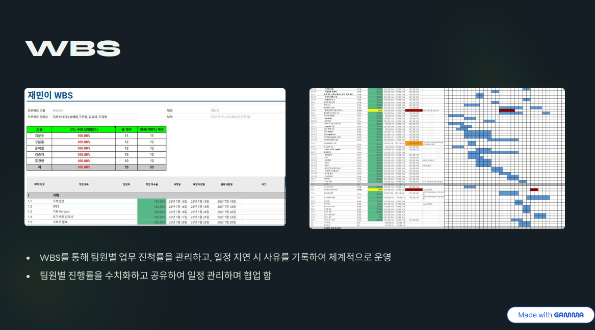
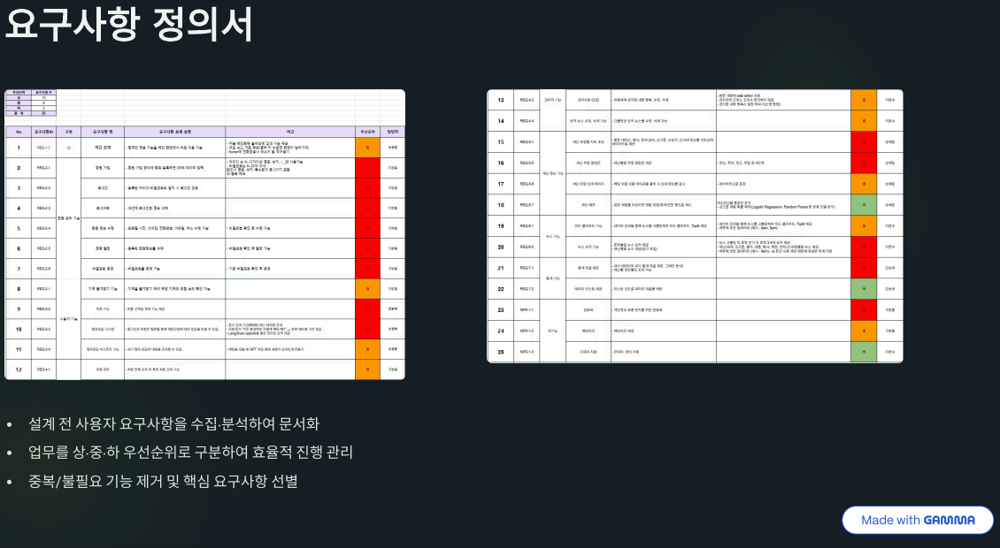
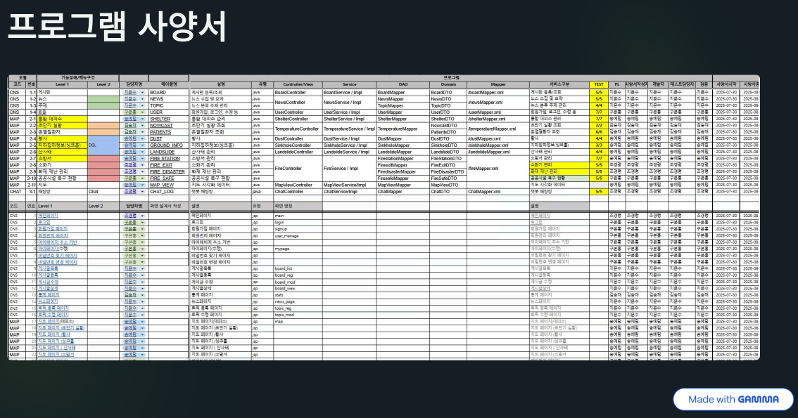
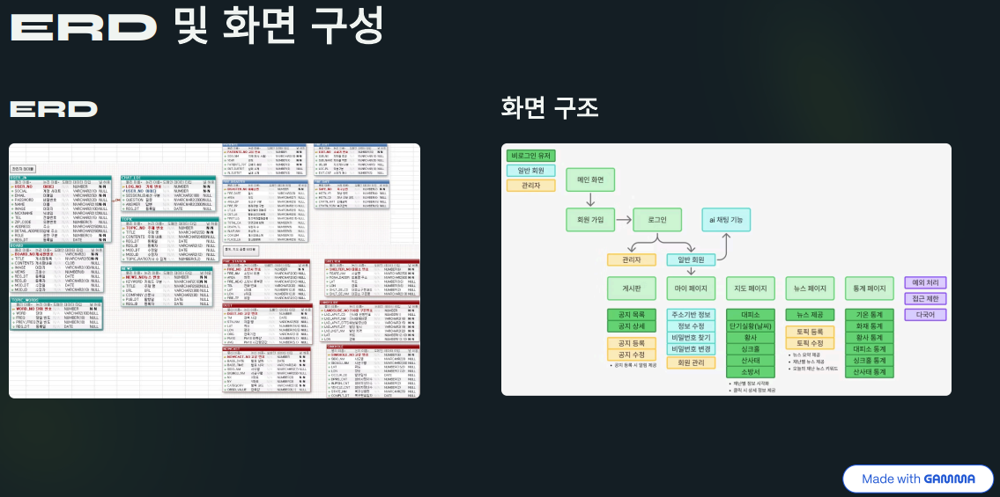
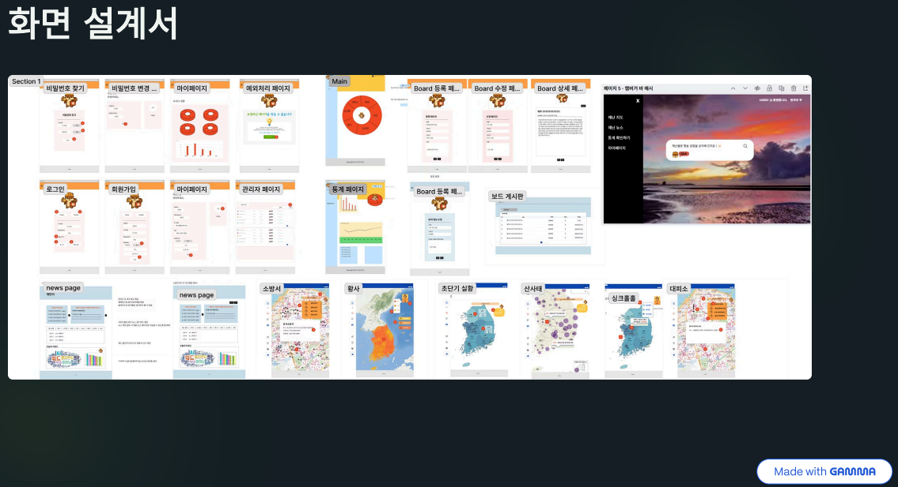
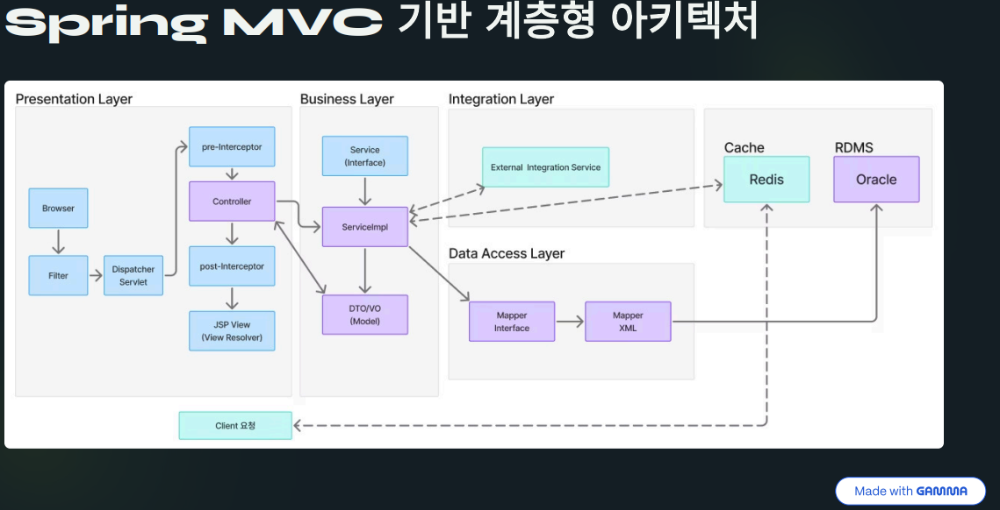
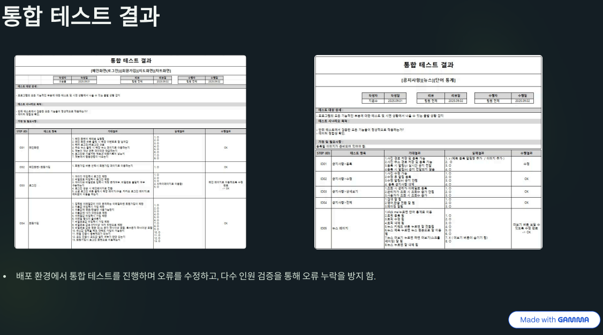

# R_DASH
R_DASH
# 🗺️ GGMAP (떠나볼지도)

  
<관광 정보 웹 사이트 제작 프로젝트>

  

## 📚 프로젝트 개요 
🫅팀구성 및 역할
1) 김승재
    - 프로그램 사양서 작성
  - 데이터 수집 ( 초단기 실황, 온열 질환자 )
  - 통계 자료 그래프 제공
  - 데이터 리스트 제공 ( 기온, 화재, 황사, 대피소, 싱크홀, 산사태 )

2) 구본홍 
  - 회원 CRUD, 로그인 / 로그아웃
  - 소셜 로그인
  - 비밀번호 암호화, 예외처리 화면
  - Redis를 활용한 이메일 인증
  - hedaer / footer, 기획서 작성 및 발표
  - AWS를 활용한 웹 서비스 배포
 
3) 송예림 
  - 공공 데이터 API 데이터 수집
  - 카카오맵 API를 활용한 재난 유형별 지도 시각화
  - 재난 위험 상세 제공 ( 통합 대피소, 황사, 날씨, 싱크홀, 소방서, 산사태 )
  - 홈페이지 마스코트 제작
    
4) 지문수 : 리더
  - WBS, ERD 기반 테이블 정의서 작성
  - 공지사항 및 알림 ( 소켓 )
  - 뉴스 기능 ( 검색API, 조회, 삭제, 크롤링, 토픽 분석, OpenAI 요약 )
  - 토픽 단어 시각화, 다국어 지원
  - PPT 담당
 
5) 조경령
  - 메인화면 페이지 구현
  - 재난 AI 챗봇 제공
  - 서기 ( 회의록 작성 )

✔️ 전체 일정   
2025.07.15 ~ 09.05 (8주간 진행)  
|구분 | 일정 | 내용 |
|---|---|---|
|기획|7/15--~7/28 |주제 선정,WBS 및 기획서,요구사항 정의서 작성|
|설계|7/28~8/8 |파일 및 화면서 작성,테이블 설계|
|개발 |6/16~7/9 |DB 구축,Source Coding,단위/최종 테스트|
|발표 |7/8~7/11 |7/11 일 최종 발표|

## 📌 프로젝트 기능
+ 메인
  - AI 챗봇 기능을 메인 화면에서 바로 이용
  - 깔끔하고 직관적인 UI와 배경 영상 화면
  - 예외처리 페이지 제공
    
+ 지도 시각화
  - 싱크홀, 황사, 산사태 등 재난 유형별 지도 시각화
  - 통합 대피소, 소방서 등 상세 위치 및 정보 제공
    
+ 뉴스
  - 재난 키워드별 뉴스 리스트 제공
  - 단어 통계(TOP10, 워드 클라우드, 단어 순위) 시각화
  - AI가 요약한 '오늘의 토픽' 리스트 및 상세 내용 제공
    
+ 통계
  - 기온, 화재, 황사, 대피소, 싱크홀, 산사태 등
  - 주요 재난 관련 데이터 통계 그래프 제공
  
+ 회원
  - 회원 정보 수정 및 탈퇴 기능
  - (관리자용) 회원 관리 기능
  - 로그인 / 로그아웃 시스템 및 비밀번호 암호화
  - 소셜 로그인 기능, (Redis)이메일 인증 기능
    
+ 공지사항
  - 공지사항 CRUD 기능
  - 실시간 공지 알림(소켓) 기능
  - 다국어 지원

## 🛠️ 기술 스택
- FrontEnd  

- BackEnd  

- DATABASE  

- TOOLS  

- Browser  

## ✒️ 산출물
✔️ WBS

✔️ 회의록

✔️ 요구사항 정의서

✔️ 프로그램 사양서

✔️ ERD 및 화면 구성

✔️ 화면 설계서

✔️ Spring MVC 기반 계층형 아키텍처

✔️ 통합 테스트 결과

## 🖼️ 결과 화면
### 메인페이지

### 회원 가입

### 로그인

### 관광지 메인

### 관광지 지도

### 관광지 상세페이지

### 관광지 등록

### 축제 메인

### 축제 상세페이지

### 축제 등록

### 마이페이지

### 정보 수정

### 회원 조회 및 강퇴

## 참고 사이트
[대한민국 구석구석](https://korean.visitkorea.or.kr/main/main.do)
