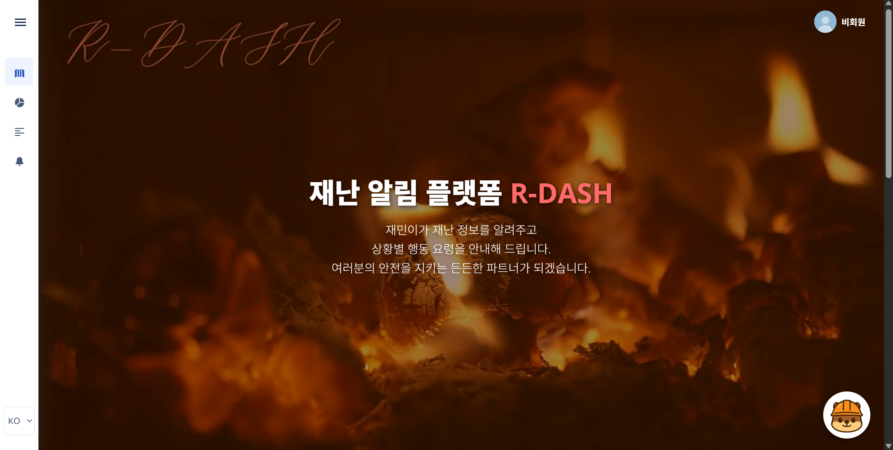
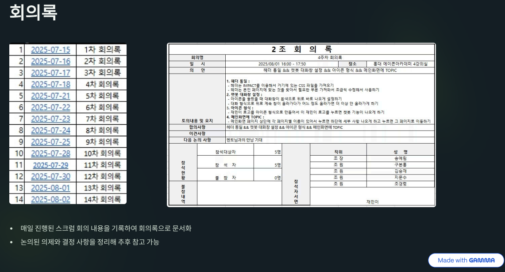

# R_DASH
R_DASH
# 🗺️ R_DASH (재민이)

  
<재난 정보 통합 웹 사이트 제작 프로젝트>

  

## 📚 프로젝트 개요 
🫅팀구성 및 역할
1) 지문수 : 리더
    - WBS, ERD 기반 테이블 정의서 작성
    - 공지사항 및 알림 ( 소켓 )
    - 뉴스 기능 ( 검색API, 조회, 삭제, 크롤링, 토픽 분석, OpenAI 요약 )
    - 토픽 단어 시각화, 다국어 지원
    - PPT 담당
    
2) 김승재
    - 프로그램 사양서 작성
    - 데이터 수집 ( 초단기 실황, 온열 질환자 )
    - 통계 자료 그래프 제공
    - 데이터 리스트 제공 ( 기온, 화재, 황사, 대피소, 싱크홀, 산사태 )

3) 구본홍 
    - 회원 CRUD, 로그인 / 로그아웃
    - 소셜 로그인
    - 비밀번호 암호화, 예외처리 화면
    - Redis를 활용한 이메일 인증
    - hedaer / footer, 기획서 작성 및 발표
    - AWS를 활용한 웹 서비스 배포
 
4) 송예림 
    - 공공 데이터 API 데이터 수집
    - 카카오맵 API를 활용한 재난 유형별 지도 시각화
    - 재난 위험 상세 제공 ( 통합 대피소, 황사, 날씨, 싱크홀, 소방서, 산사태 )
    - 홈페이지 마스코트 제작
 
5) 조경령
    - 메인화면 페이지 구현
    - 재난 AI 챗봇 제공
    - 서기 ( 회의록 작성 )

✔️ 전체 일정   
2025.07.15 ~ 09.05 (8주간 진행)  
|구분 | 일정 | 내용 |
|---|---|---|
|기획|7/15~7/28 |주제 선정,WBS 및 기획서,요구사항 정의서 작성|
|설계|7/28~8/8 |파일 및 화면서 작성,테이블 설계|
|개발 |8/6~8/26 |DB 구축,Source Coding|
|     |8/18~9/2 |공동 tiles 및 웹 제작,단위/최종 테스트|
|발표 |9/2~9/4 |PPT 최종 검토 및 9/5 일 최종 발표|

## 📌 프로젝트 기능
+ 메인
  - AI 챗봇 기능을 메인 화면에서 바로 이용
  - 깔끔하고 직관적인 UI와 배경 영상 화면
  - 예외처리 페이지 제공
    
+ 지도 시각화
  - 싱크홀, 황사, 산사태 등 재난 유형별 지도 시각화
  - 통합 대피소, 소방서 등 상세 위치 및 정보 제공
    
+ 뉴스
  - 재난 키워드별 뉴스 리스트 제공
  - 단어 통계(TOP10, 워드 클라우드, 단어 순위) 시각화
  - AI가 요약한 '오늘의 토픽' 리스트 및 상세 내용 제공
    
+ 통계
  - 기온, 화재, 황사, 대피소, 싱크홀, 산사태 등
  - 주요 재난 관련 데이터 통계 그래프 제공
  
+ 회원
  - 회원 정보 수정 및 탈퇴 기능
  - (관리자용) 회원 관리 기능
  - 로그인 / 로그아웃 시스템 및 비밀번호 암호화
  - 소셜 로그인 기능, (Redis)이메일 인증 기능
    
+ 공지사항
  - 공지사항 CRUD 기능
  - 실시간 공지 알림(소켓) 기능
  - 다국어 지원

## 🛠️ 기술 스택
- FrontEnd  

- BackEnd  

- DATABASE  

- TOOLS  

- Browser  

## ✒️ 산출물
✔️ WBS

✔️ 회의록

✔️ 요구사항 정의서

✔️ 프로그램 사양서

✔️ ERD 및 화면 구성

✔️ 화면 설계서

✔️ Spring MVC 기반 계층형 아키텍처

✔️ 통합 테스트 결과

## 🖼️ 결과 화면
### 메인페이지

### 챗봇

### 회원 가입

### 로그인

### 마이페이지

### 비밀번호 찾기

### 회원 관리

### 지도
#### 날씨

#### 산사태

#### 싱크홀

#### 황사

#### 소방서

#### 대피소

### 통계
#### 화재

#### 기온

#### 황사

#### 싱크홀

#### 산사태

### 뉴스 페이지

### 토픽

#### 토픽 등록

#### 토픽 수정

### 공지사항

#### 공지사항 등록

#### 공지사항 상세

#### 공지사항 알림

